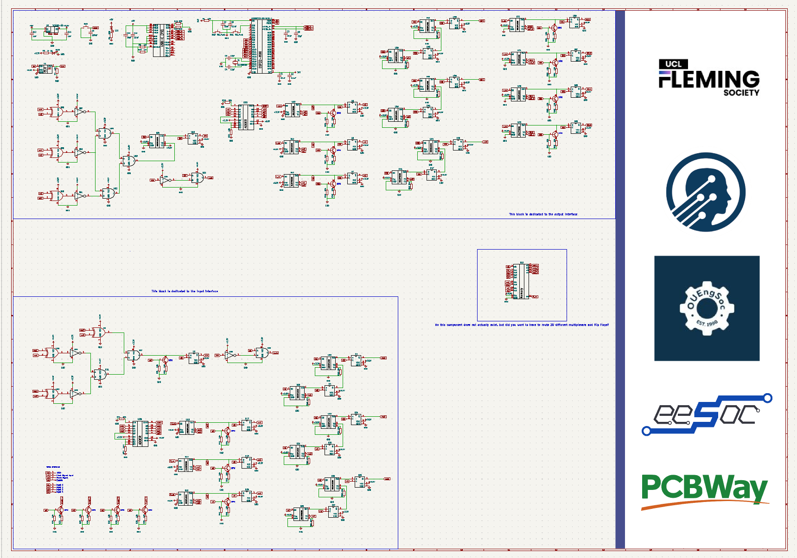

# UCL x KCL x Oxford x Imperial x Cambridge x Edinburgh: 2026 PCB Challenge | Sponsored by PCBWay

UCL, KCL and Oxford, Cambridge, Imperial and Edinburgh are proud to present the 2026 PCB Challenge. Many thanks to PCBWay for sponsoring the prizes. 

If you have any questions please email zceepvb@ucl.ac.uk. Please keep in mind you cannot make a submission/be eligible for the prizes if you do not attend any of the universities organising this event. Within the 7 day period this event is being hosted, any university Engineering society is free to reach out to collaborate at this email address. 

All files are meant for KiCAD v10.0, if you have not updated, you probably should. It is a much better version than KiCAD v9.0 (includes dark mode). 

The event is running from the **12th of October to the 19th of October.**

## Overview

This challenge invites participants to implement the given schematic as a fully wired PCB in the smallest possible size. As an added challenge the purpose of the PCB itself is left ambiguous. You are provided a schematic with all component values and connections intact, and a footprint associated with each schematic symbol. The event runs fully online, and all the necessary information can be found in this GitHub. 

I was inspired to create this challenge by a friend, Taylan Arslan, who gave me what was an essentially impossible challenge to get his PCB to fit within a 40mmx40mm constraint. Despite it being impossible, I learned a lot in those two days trying to accomplish this and the end result is a PCB that I am still very proud of. I hope that participants will also share the same feeling of satisfaction that I got, with the added bonus that this one is not impossible since the smallest possible size is to be determined by one of you. 

From my own experience, no matter how much you may like designing PCBs, ultimately it will become a bit repetitive. Thus to make this challenge more interesting; besides the monetary prize; I also decided to make the purpose of the PCB itself a puzzle to be solved.

## The Challenge

1. **Logic Deduction**: deduce the digital logic function implemented by the provided schematic, purely from the schematic itself (no functional description is given). Deducing this will give you bonus points.
2. **PCB Layout**: design a fully wired, single board PCB implementation of that logic, optimised for the smallest possible board area, within the design constraints below.

This challenge will be running for 7 days, **until the midnight of October 19th.**

Make your **submission** here:
https://forms.cloud.microsoft/e/69LKd5ykra

Your challenge submission should be a public GitHub repo. In this repo you just need to include the files we need. Your submission for the logic deduction is in the form itself. 

## Design Constraints

The keep out zone of the ESP32 antenna does not have to cover any PCB area, it can be left hanging off the edge of the PCB. 

### Board & Layer Stack
- Four layer board (F.Cu / B.Cu + 2 inner layers), 1.6 mm standard FR4 thickness.
- Board outline may be any shape, but must be a single contiguous board (no panelisation or multi-board tricks to reduce measured area).
- Management of the 4 layer stack up (e.g. assignment of signal/power/ground to inner layers) is left entirely to the participant; there is no required or predefined ground/power/signal layer assignment. However, you will be penalised for a stack up that would not actually work. 

### Trace & Clearance Rules
- Minimum trace width: 0.15 mm (6 mil).
- Minimum clearance (trace to trace, trace to pad, trace to via): 0.15 mm (6 mil).
- Minimum copper to board edge clearance: 0.3 mm.
- These values should be set as the global minimum in KiCad's Clearance rules so DRC enforces them automatically. We will check the DRC ourselves when judging. 

### Via Rules
- Minimum via drill diameter: 0.3 mm.
- Minimum via annular ring: 0.15 mm (i.e. minimum via pad diameter of approximately 0.6 mm).
- Vias in pads are not permitted.

### Footprint Rules
- Only default KiCad footprints, or footprints explicitly provided as part of the challenge, may be used.
- Footprints must not be modified from the library originals (this will be checked via KiCad's "footprint does not match library" DRC warning; note that editing a local copy of the library will not bypass this check, and manual review may also be used).
- All footprints must have correctly defined courtyard layers (F.CrtYd / B.CrtYd), and courtyards must not overlap between components. This is enforced via KiCad's built in "courtyard overlap" DRC check.
- Traces and vias may not be routed underneath IC footprints (i.e. within the courtyard area of any IC).

### Silkscreen
- Boards do not need to retain fully legible silkscreen labelling. 

### DRC Pass Criteria
- All submitted boards must pass KiCad's Design Rule Checker (Inspect → Design Rules Checker) with **zero unresolved DRC errors**.
- DRC **warnings** (e.g. minor silkscreen clipping) will not disqualify a board, but excessive or careless warnings may count against a board at the routing quality tie break stage.
- A board with unresolved DRC errors is disqualified from the size based ranking regardless of its footprint area.

### Note on High-Speed & Power Rules
The challenge schematic does include a high speed signal paths (a differential pair requiring a continuous reference plane). It does not however have a significant power delivery requirement (e.g. wide power traces, stitching vias). As such, no specific power plane rules are imposed in this iteration. 

## Judging Criteria

1. **Pass/fail gate**: correct logic deduction and a fully wired, DRC clean board (zero errors) under the given constraints. Boards failing either condition are not eligible for prizes.
2. **Primary ranking metric**: smallest board area (bounding box of the board outline), among all boards that pass the gate above.
3. **Tie breaker**: in the event of a tie, judges will assess routing quality and general layout practice (e.g. via count, trace directness, use of ground fill, silkscreen space, DRC warning count) to determine placement.

## Prizes

- **1st place:** £200
- **2nd place:** £100
- **3rd place:** £50

- All participants who submit a valid entry will receive a certificate of participation, a 10$ coupon on orders above 30$ for PCBWay and a PCB ruler from PCBWay. To be classified as a participant you must actually complete the PCB, this meaning that all the connections have been connected with a trace. Auto trace does not count. 

Expect the results to be announced within a week or two from the end date of the challenge.
